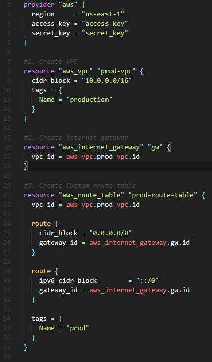

# First Terraform Project
My first time messing around with terraform. The code creates a VPC in AWS and launches an apache server on a Ubuntu AMI.
There are 9 parts to the code. You will need to enter your own access key and secret access key within the first part of the code to link it to your AWS account.
The Screenshot below shows the first 3 parts of the code. 

